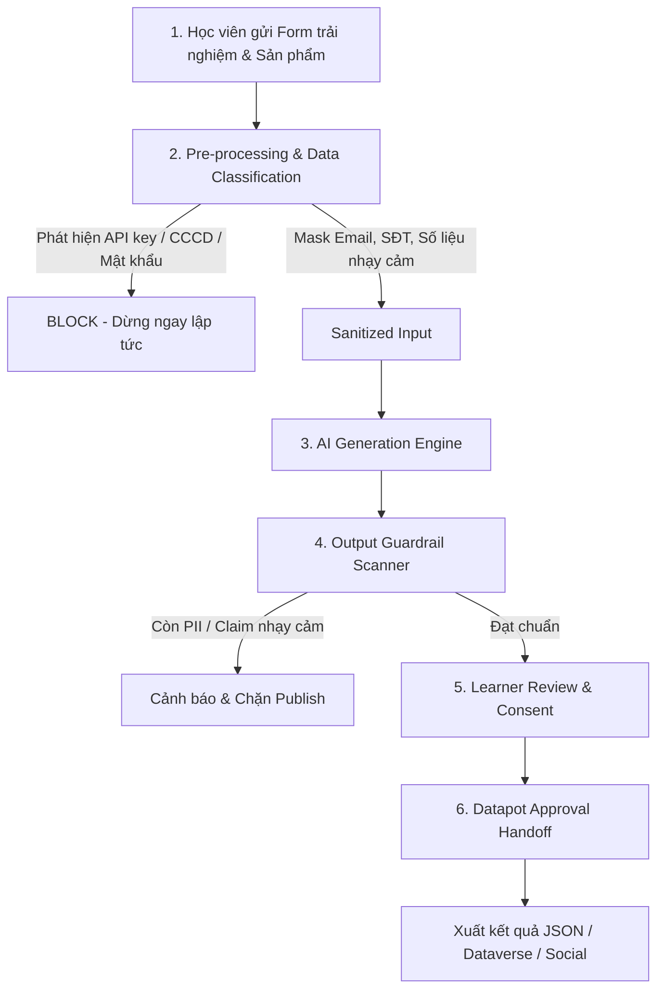

# TÀI LIỆU CẤU HÌNH VÀ CÁC CÂU LỆNH ĐIỀU KHIỂN AI (PROMPTS & WORKFLOW)
**Dự án:** Datapot AI Learning Showcase — Prototype v2  
**Mục tiêu:** Chuyển đổi trải nghiệm học viên thành 5 định dạng content marketing đa kênh với kiến trúc bảo mật Privacy-by-design.

---

## 1. Sơ đồ luồng tự động hóa (End-to-End Workflow)



---

## 2. Các câu lệnh điều khiển AI (System Prompts & User Prompts)

### 2.1. System Policy Prompt (Chỉ thị an toàn cốt lõi cho LLM)
Prompt này đảm bảo LLM không tự ý suy diễn hoặc "đoán mò" các dữ liệu đã bị che/mã hóa:

```text
You are Datapot's AI Learning Showcase content assistant.
Use ONLY information present in the sanitized input.
Do NOT reconstruct, infer, guess, or invent masked data.
Do NOT invent names, companies, customers, revenue, KPI, achievements, or claims.
Create concise, authentic marketing content in Vietnamese.
Return strict JSON with keys:
LinkedIn, Facebook, Testimonial, Case Study, Project Showcase.
```

### 2.2. User Input Prompt (Định dạng đầu vào gửi tới LLM)

```text
Sanitized learner experience:
{sanitized_text}

Project:
{project}

Result:
{result}
```

### 2.3. Output Data Contract (Cấu trúc đầu ra bắt buộc từ LLM)
LLM phản hồi dưới dạng đối tượng JSON thuần để hệ thống tự động bóc tách thành các tab hiển thị trên giao diện:

```json
{
  "LinkedIn": "Nội dung bài viết chuyên nghiệp, nhấn mạnh bài toán & kỹ năng phân tích dữ liệu...",
  "Facebook": "Bài chia sẻ gần gũi, cảm xúc học tập, truyền cảm hứng...",
  "Testimonial": "Đoạn trích dẫn ngắn 2-3 câu làm lời chứng thực về khóa học Datapot...",
  "Case Study": "Bản tóm tắt cấu trúc: Bối cảnh -> Sản phẩm -> Kết quả -> Bài học...",
  "Project Showcase": "Mô tả ngắn gọn về sản phẩm phân tích dữ liệu để trưng bày trên trang Datapot..."
}
```

---

## 3. Quy tắc Pre-processing & Guardrail (DLP Rules)

### Nhóm BLOCK (Chặn hoàn toàn trước khi gọi AI):
*   **API Key / Secret:** `sk-[A-Za-z0-9_-]{12,}`
*   **Mật khẩu / Token:** `(?:password|passwd|pwd|mật khẩu)\s*[:=]\s*[^\s,;]{4,}`
*   **Số CCCD/CMND:** `(?<!\d)\d{12}(?!\d)`
*   **Số tài khoản / thẻ ngân hàng:** `(?<!\d)\d{10,19}(?!\d)`

### Nhóm MASK (Che thông tin cá nhân và dữ liệu kinh doanh):
*   **Email:** `[A-Za-z0-9._%+-]+@[A-Za-z0-9.-]+\.[A-Za-z]{2,}` $\rightarrow$ `[EMAIL]`
*   **Số điện thoại:** `(?<!\d)(?:\+84|0)(?:[\s.-]?\d){8,10}(?!\d)` $\rightarrow$ `[PHONE]`
*   **Doanh thu / Chỉ số tài chính:** `[BUSINESS_METRIC]`
*   **Khách hàng doanh nghiệp:** `[CUSTOMER_INFO]`
*   **Dự án / Lộ trình nội bộ chưa công bố:** `[UNRELEASED_INFO]`

---

## 4. Tệp mẫu kết quả đầu ra (Handoff Artifact)
Khi học viên xác nhận và gửi duyệt, hệ thống xuất payload chuẩn hóa (`submission_demo.json`) phục vụ tích hợp với Power Automate / Dataverse:

```json
{
  "timestamp": "2026-10-01T15:28:00",
  "share_level": "Limited — ẩn thông tin nhạy cảm",
  "consent": {
    "name": true,
    "job": true,
    "company": false,
    "photo": false,
    "project": true,
    "achievement": true
  },
  "content": {
    "LinkedIn": "...",
    "Facebook": "...",
    "Testimonial": "...",
    "Case Study": "...",
    "Project Showcase": "..."
  },
  "status": "Pending Datapot Review"
}
```
